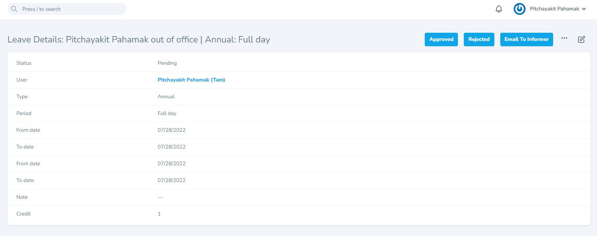
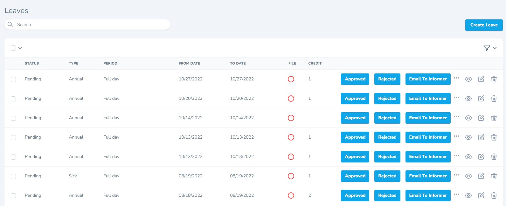

# Laravel Nova action button selector

[](https://packagist.org/packages/lemonlabs/nova-action-button-selectors)
[](https://packagist.org/packages/lemonlabs/nova-action-button-selectors)

This package allows you to add buttons for Nova actions on the detail page instead having them all within the dropdown menu.

This package is forked from [`lednerb/nova-action-button-selectors`](https://codeberg.org/Lednerb/nova-action-button-selectors)

## Requirements
- `php: ^8`
- `laravel/nova: ^4|^5`

## How to install
```
composer require lemonlabs/nova-action-button-selectors
```
Detail page


Index page with inline action



## Usage

In your Action class define the following trait:

```php
...
use LemonLabs\ActionButtonSelector\ShowAsButton;

class MyAction extends Action
{
    use InteractsWithQueue, Queueable;
    use ShowAsButton;

    ...
```

If you want to hide the button on some Detail pages, use the following method in the Nova Model's `actions` array:

```php
...
 public function actions(NovaRequest $request)
    {
        return [
            MyCustomAction::make()
                ->onlyOnDetail()
                ->withoutConfirmation()
                ->showAsButton(false),

            ...
```
